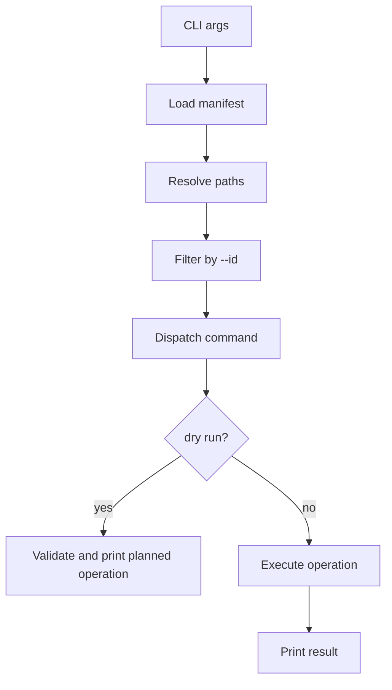

# Config Manager Design

## Scope

Config Manager is a small Python CLI for deploying this repo's tracked
configuration files across Windows, Linux, and macOS. It replaces shell-specific
copy logic with a JSON manifest and a shared implementation.

## Files

```text
tracked-configs.json
tools/config-manager/
  usage.md
  design.md
  manage.py
  tracked-configs.schema.json
  config_manager/
    __init__.py
    cli.py
    model.py
    paths.py
    planner.py
    operations.py
    compare.py
    platform.py
    output.py
manage.sh
manage.ps1
```

`manage.sh` and `manage.ps1` are optional wrappers. They must contain no config
logic.

## Module Responsibilities

| Module | Responsibility |
| --- | --- |
| `manage.py` | Minimal executable entry point that calls `config_manager.cli.main()` |
| `cli.py` | Argument parsing, command dispatch, exit codes |
| `model.py` | Manifest dataclasses, JSON loading, schema-level validation |
| `paths.py` | Resolve repo-relative `source` and home-relative `target` paths |
| `planner.py` | Filter entries by `--id` while preserving manifest order |
| `operations.py` | Execute copy, collect, and link actions |
| `compare.py` | Compare files, directories, link targets, and unified text diffs |
| `platform.py` | Platform-specific link creation and link inspection |
| `output.py` | Human-readable and JSON output formatting |

## Data Model

```python
@dataclass(frozen=True)
class Entry:
    id: str
    source: str
    method: Literal["copy", "link"]
    targets: tuple[str, ...]

@dataclass(frozen=True)
class ResolvedTarget:
    id: str
    source: Path
    target: Path
    method: Literal["copy", "link"]
```

`source` is repo-relative in JSON and absolute after path resolution. Each value
in `targets` may use `~` in JSON and is absolute after path resolution.

An entry may have multiple targets. This covers agent-specific deployments such
as `~/.agents/skills` and `~/.claude/skills` while preserving a single source of
truth.

## Command Flow



`compare` uses the same load, resolve, and filter flow, then calls comparison
helpers instead of mutation operations.

## Operation Interfaces

```python
def deploy_copy(entry: ResolvedTarget, *, dry_run: bool, prompt: bool) -> OperationResult:
    ...

def collect_copy(entry: ResolvedTarget, *, dry_run: bool, prompt: bool) -> OperationResult:
    ...

def ensure_link(
    entry: ResolvedTarget,
    *,
    dry_run: bool,
    prompt: bool,
    platform: PlatformOps,
) -> OperationResult:
    ...

def compare_entry(entry: ResolvedTarget, platform: PlatformOps) -> CompareResult:
    ...
```

`operations.py` owns high-level behavior. It should not branch directly on
Windows, Linux, or macOS except through `PlatformOps`.

## Platform Strategy

Use Python's platform-independent interfaces for normal work:

- `pathlib.Path` for path handling
- `shutil.copy2` and `shutil.copytree` for copying
- `filecmp` for equality checks
- `difflib.unified_diff` for text diff output
- `Path.symlink_to` for symlink creation

Use a small platform adapter only where Python behavior is not uniform enough:

```python
class PlatformOps(Protocol):
    def create_link(self, source: Path, target: Path) -> LinkResult:
        ...

    def inspect_link(self, path: Path) -> LinkInfo:
        ...
```

Adapters:

| Adapter | Link Behavior |
| --- | --- |
| `PosixOps` | Create symlinks for files and directories |
| `WindowsOps` | Try symlink first; for directories, fall back to junction |

Windows junction creation uses `cmd.exe /c mklink /J` behind the adapter. The
rest of the tool sees only `LinkResult`.

## Command Rules

Command dispatch applies these rules after entries are loaded, resolved, and
filtered:

| Entry Method | Command | Planned Action |
| --- | --- | --- |
| `copy` | `deploy` | Copy source to target |
| `copy` | `collect` | Copy target to source |
| `copy` | `compare` | Compare source and target |
| `link` | `deploy` | Ensure target links to source |
| `link` | `collect` | Validate link; no copy |
| `link` | `compare` | Inspect link and optionally compare contents |

Dry runs call the same operation functions as mutating commands, but return
planned actions before prompts or filesystem changes are made. Non-dry-run
`deploy` and `collect` prompt once per resolved target before execution.

## Validation

Validation failures stop before mutation:

- manifest is valid JSON
- `schemaVersion` is supported
- each entry has `id`, `source`, `targets`, and `method`
- entry ids are unique
- requested `--id` values exist
- source exists for `deploy`
- target exists for `collect`
- `link` file entries can use symlinks on the platform
- existing targets are correct links or eligible for replacement

Warnings do not stop execution. Example: Windows directory symlink creation may
fall back to a junction.
